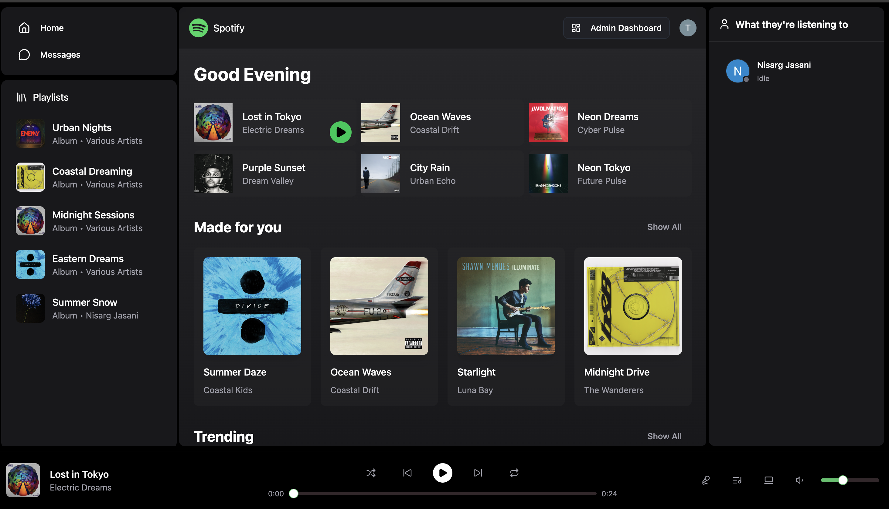
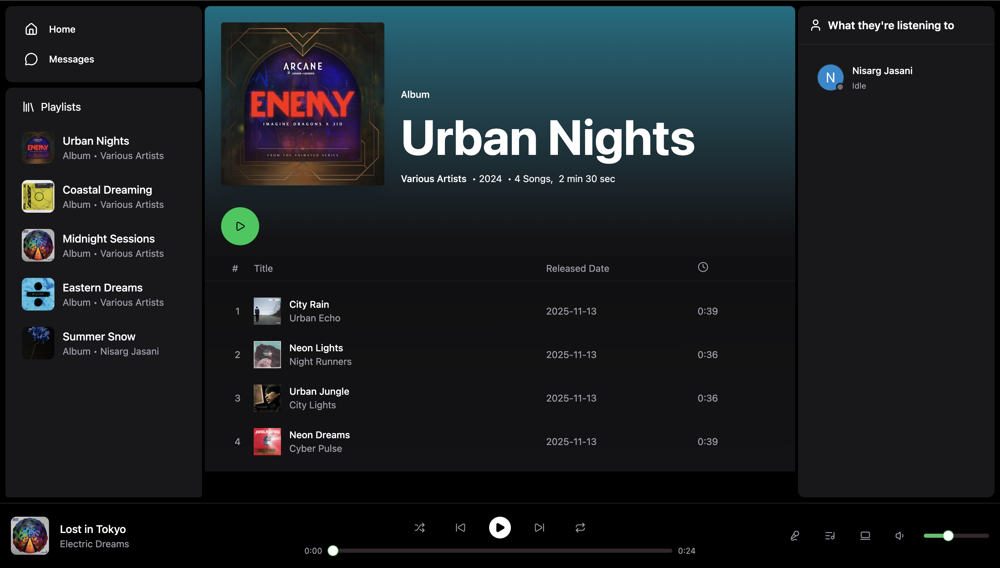

# 🎵 Soundify — Full-Stack Spotify Clone

Soundify is a modern full-stack music streaming application inspired by Spotify.  
It supports **user authentication**, **song & album uploads**, **streaming**, **real-time chat**, and **friends activity** — powered by **React, Node.js, Clerk, MongoDB, Cloudinary, and Socket.IO**.

### 🚀 Live Demo  
🔗 **https://soundify-a0uy.onrender.com/**

<p align="center">
  
</p>

---

## 🏷️ Tech Stack

<p align="center">
  
  
  
  
  
  <br />
  
  
  
  
  
</p>

---


## 📁 Project Structure

```
soundify/
├── backend/                 # Node.js + Express API
│   ├── src/
│   │   ├── index.js         # Server entry point
│   │   ├── lib/             # DB, cloudinary, socket helpers
│   │   ├── models/          # Mongoose schemas
│   │   ├── routes/          # REST routes
│   │   ├── controller/      # Route controllers
│   │   └── seeds/           # Seeding scripts
│   └── .env
│
├── frontend/                # React + Vite + TS
│   ├── src/
│   │   ├── pages/           # Route pages (Home, Admin, Chat)
│   │   ├── layout/          # Shared layouts
│   │   ├── components/      # Reusable components
│   │   ├── stores/          # Zustand state store
│   │   └── lib/             # Axios client, hooks
│   │   └── types/
│   │   └── providers/ 
│   └── .env
│
└── README.md
```

---

## 🔧 Features

### 🎵 User Features
- Signup/Login via Clerk  
- Browse albums, songs, and artists  
- Stream audio with custom player UI  
- View real-time **friends activity**  
- Chat with friends using Socket.IO  
- Save & explore uploaded albums/songs  

### 👑 Admin Features
- Upload songs (Cloudinary)  
- Upload albums with artwork  
- Delete or manage songs/albums  
- Protected via admin email + Clerk session  

---

## 🔐 Environment Variables

### backend/.env
```
PORT=5001
MONGODB_URI=<your_mongodb_uri>
ADMIN_EMAIL=<admin_user_email>

# Cloudinary
CLOUDINARY_CLOUD_NAME=<cloud_name>
CLOUDINARY_API_KEY=<api_key>
CLOUDINARY_API_SECRET=<api_secret>

# Clerk
CLERK_PUBLISHABLE_KEY=<clerk_publishable_key>
CLERK_SECRET_KEY=<clerk_secret_key>
```

### frontend/.env
```
VITE_CLERK_PUBLISHABLE_KEY=<clerk_publishable_key>
```

---

## 🚀 Local Setup

### Install dependencies
```bash
cd frontend && npm install
cd ../backend && npm install
```

### Start backend
```bash
cd backend
npm run dev
```

### Start frontend
```bash
cd frontend
npm run dev
```

Open **http://localhost:5001**

---

## 🌩️ Media Uploads (Cloudinary)

Uploaded assets include:
- Audio files (songs)  
- JPEG/PNG album cover images  

Backend uses:
- `express-fileupload`  
- Cloudinary Node SDK  

Ensure your Cloudinary credentials are correct and temp paths are writable.

---

## 🔌 API Overview (Backend)

| Endpoint | Description |
|---------|-------------|
| `POST /api/auth/callback` | Clerk user sync |
| `GET /api/users` | List all users except the current |
| `GET /api/users/messages/:id` | Fetch chat history |
| `POST /api/admin/songs` | Upload new song |
| `POST /api/admin/albums` | Upload new album |
| `GET /api/stat` | Admin stats |

---

## 🎯 Real-Time Features (Socket.IO)
- Live chat  
- Friends activity panel  
- “User is listening to…” presence  
- Idle/active indicators  

---

## 🧪 Seeding
```bash
cd backend
npm run seed:songs # inserts sample songs
npm run seed:albums # inserts sample albums and links songs
```

---

## 📦 Linting
```bash
cd frontend
npm run lint
```

---

## 🛣️ Roadmap
- Playlist creation system  
- Waveform-based audio seeking  
- Artist dashboard  
- Mobile UI improvements  
- Full deployment on Vercel + Railway  

---

## 📸 Screenshots

### 🏠 Home Page  
<p align="center">
  
</p>


### 💬 Chat + Activity  
<p align="center">
  
</p>

### 📀 Album View  
<p align="center">
  
</p>

---

## 🚀 Next Steps

### 🔧 Infrastructure & Deployment
- Containerize the full stack with Docker and prepare for Kubernetes deployment.
- Add CI/CD pipelines (GitHub Actions) for automated builds and linting.
- Move backend deployment from Render to a scalable service such as Railway/Fly.io.
- Add environment-specific deployments (dev, staging, prod).

### 🎵 Features & UX
- Implement user playlists, favorites, and recently played history.
- Add waveform scrubbing and advanced player controls.
- Create Artist Dashboards for uploads, analytics, and management.
- Add theme switching (light/dark modes).

### 👥 Social Features
- Add user profile pages.
- Follow/unfollow system.
- “Friend Listening Now” enhancements like hover cards and history.

### ⚡ Performance & Reliability
- Add Redis caching for song metadata and user sessions.
- Preload audio buffers for smoother playback.
- Improve WebSocket reconnection logic and fallbacks.

---

## Notes
- Socket.IO activity updates broadcast “Playing …” and “Idle” statuses; friends see them in the Friends Activity panel.
- Image/audio uploads go to Cloudinary via `express-fileupload`; ensure temp dir is writable.
- If port 5001 is occupied (e.g., macOS ControlCenter), change `PORT` in `backend/.env` and update frontend `axios` base URL accordingly.